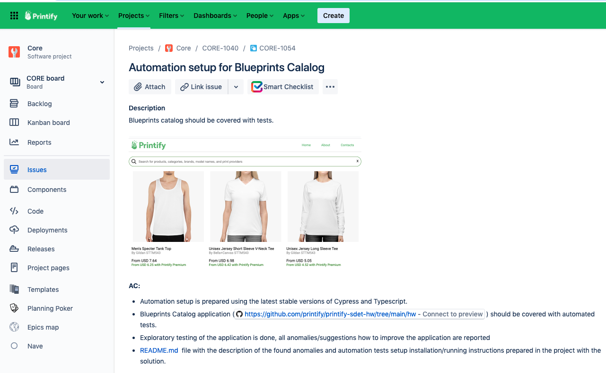

# Automation HW

### Task

### Notes

- you should create the solution in your own repo with the following pattern `jdoe/hw`, where `jdoe` is your github username
- use command `npm i` to install app dependencies
- use command `npm run start` to run the app
- good luck! 🚀
